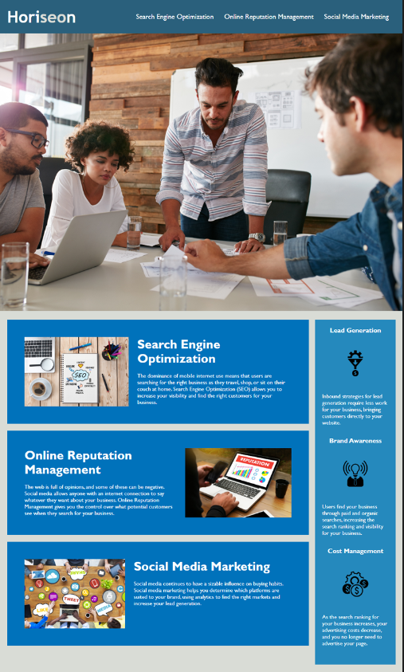

# Code Refactor Starter Code

# Code Refactor Starter Code -Horiseon

## Table of Contents

 [Summary](#overview)
    [The challenge](#the-challenge) 
    [Screenshot](#screenshot)
    [Links](#Links)
 [Progress](#Progress)
    [Created with](#Created-with)
    [What I learned](#What-I-learned)   
    [Author](#Author)
    

## Summary

### The Challenge

User should be able to

 reach the corresponding title by clicking on the navigation.

### Screenshot

### Links
 Solution URL: 
 LIve Site URL:

## Progress

### Created with
 CSS
 Semenatic HTML

### Conclusion
 Try to use class to reduce the same commands in css
 It is better to build HTML with semantic elements to provide a better reading experience
 Add the id attribute to the headings that needs to be navigated
 Unique title is needed
 Lastly, image elements need to have the alt attributes to add the additional information in html